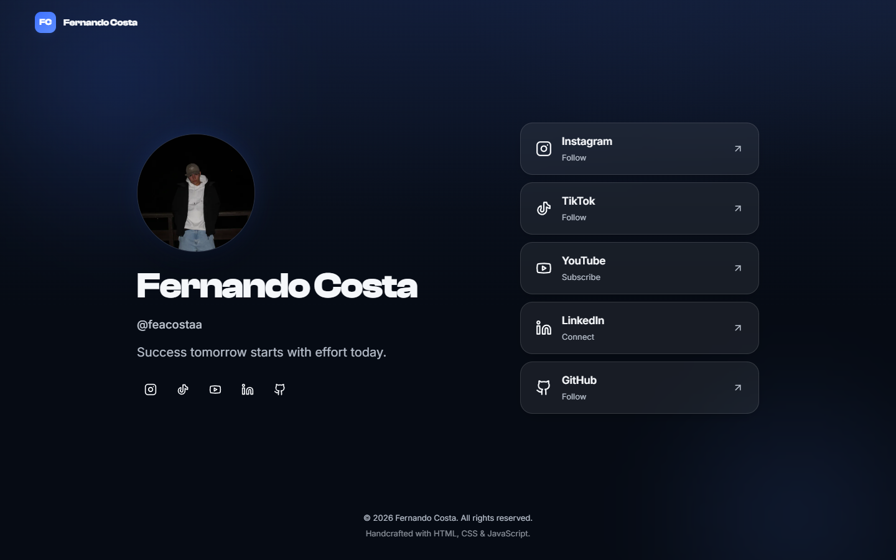

<div align="center">


# Fernando Costa — Personal Profile

**Success tomorrow starts with effort today.**

A premium personal landing page built on the concept of _Quiet Luxury Digital_ —
minimal, elegant and fast. Handcrafted with pure HTML, CSS and JavaScript.

**🔗 Live at [feacostaa.vercel.app](https://feacostaa.vercel.app/)**

[](https://feacostaa.vercel.app/)


</div>

---

## ✦ Overview

A single-screen profile that helps visitors, in a few seconds:

- understand who Fernando Costa is;
- reach every social network;
- find LinkedIn and GitHub;
- feel confidence in the personal brand.

The experience is meant to be memorable for the **quality of the design**, not the
quantity of effects. No framework, no library, no build step — just well-organized
front-end fundamentals.

## ✦ Preview

<div align="center">
  
</div>

> Layout preview, shown with a placeholder avatar. The live site uses the real photo.

## ✦ Tech Stack

| Area        | Choice                                                        |
| ----------- | ------------------------------------------------------------ |
| Markup      | Semantic **HTML5** (`header`, `main`, `section`, `nav`, `footer`) |
| Styling     | **CSS3** — custom properties, Grid, Flexbox, `backdrop-filter` |
| Behavior    | **JavaScript ES6+** — ES modules, zero dependencies          |
| Typography  | **Clash Display** (titles) · **Inter** (body) — self-hosted   |
| Icons       | **Lucide** (outline) · **Tabler** for TikTok — inlined SVG sprite |
| Hosting     | **Vercel** (static)                                          |

## ✦ Highlights

- **Quiet Luxury Digital** aesthetic — negative space, soft shadows, discrete glass.
- **Design tokens** in a single `variables.css` (colors, spacing, radii, shadows…).
- **BEM** naming and a CSS architecture split by responsibility.
- **Glassmorphism** buttons with subtle hover (more solid, slight scale, icon → blue).
- **Self-hosted variable font** (Inter) — one file covers weights 400–600.
- **Accessibility first** — semantic landmarks, keyboard focus, `aria-label`s,
  `prefers-reduced-motion`, AA contrast.
- **Performance** — preloaded fonts, inline SVG sprite (no icon requests), deferred
  ES modules, no render-blocking third parties.

## ✦ Project Structure

```text
Fernando-Costa-Profile/
├── assets/
│   ├── fonts/        # self-hosted woff2 (Clash Display, Inter variable)
│   ├── icons/        # source SVGs (Lucide + Tabler)
│   ├── profile/      # profile photo  ← drop fernando-costa.jpg here
│   ├── images/
│   ├── og-image/
│   └── favicon/      # favicon.svg
├── css/
│   ├── reset.css        # minimal modern reset
│   ├── variables.css    # design tokens (:root)
│   ├── typography.css   # @font-face + type scale
│   ├── style.css        # global base + ambient background
│   ├── layout.css       # grid / flex / containers
│   ├── components.css   # BEM components
│   ├── animations.css   # keyframes + motion (reduced-motion aware)
│   └── responsive.css   # all media queries
├── js/
│   ├── main.js          # entry point
│   ├── animations.js    # entrance reveal + background control
│   └── utils.js         # tiny helpers
├── docs/
├── index.html
├── README.md
├── LICENSE
└── .gitignore
```

> Stylesheets are linked individually in `index.html` (cascade order) instead of via
> `@import`, to avoid a request waterfall. `assets/fonts/` was added because the fonts
> are self-hosted.

## ✦ Getting Started

Because the site uses ES modules, open it through a local server (not `file://`):

```bash
# Option 1 — Node
npx serve .

# Option 2 — Python
python -m http.server 8000

# Option 3 — VS Code
# Right-click index.html → "Open with Live Server"
```

Then visit `http://localhost:3000` (or the printed port).

## ✦ Deploy (Vercel)

It is a static site — no build command, no output directory.

1. Push the repository to GitHub.
2. Import it on [vercel.com](https://vercel.com) (Framework Preset: **Other**).
3. Deploy. You get a free `*.vercel.app` URL.

**Custom domain (`feacostaa.com`):** Vercel's free plan supports custom domains.
Buy the domain, add it in _Project → Settings → Domains_, point the DNS, then update the
four absolute URLs in `index.html` (`canonical`, `og:url`, `og:image`, `twitter:image`).

## ✦ Performance

- Fonts preloaded and served with `font-display: swap`; Inter ships as a single
  variable file.
- Icons are one inline SVG sprite — no icon font, no extra requests.
- JavaScript is deferred (ES modules) and dependency-free.
- Image uses `fetchpriority="high"` + `decoding="async"`; a WebP version is recommended
  once the photo is added.
- CSS is small, flat-selector and free of duplication.

Target: **Lighthouse 95+** across Performance, Accessibility, Best Practices and SEO.

## ✦ Responsiveness

Tested from small phones to ultrawide monitors:

- **Mobile** — single centered column.
- **Desktop / Notebook** — two columns (identity · social buttons).
- **Tablet / Ultrawide** — fluid spacing with a capped container width.

## ✦ Customization

| Want to change… | Edit                                                            |
| --------------- | -------------------------------------------------------------- |
| Photo           | Replace `assets/profile/fernando-costa.jpg`                    |
| Colors / tokens | `css/variables.css`                                            |
| Links           | The `href`s in `index.html`                                    |
| Domain / SEO    | The four absolute URLs in `index.html`                          |

## ✦ License

Released under the [MIT License](LICENSE) © 2026 Fernando Costa.
